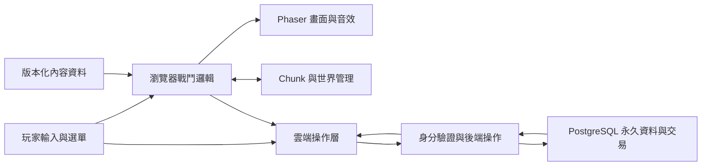

# GOGO RPG — 技術架構審閱稿

版本：v1.0 開發基準（保留 v0.27 架構正文）  
日期：2026-09-20  
狀態：已依使用者授權進入實作，本機可玩版本與正式雲端架構分階段交付。  
遊戲規則來源：[GDD](GDD.review.md)

## 0. 狀態與範圍

- **已確認**為使用者逐輪採用的技術方向及產品要求。
- **架構基準**包含原提案及 [v1.0 決策基準](DECISIONS.md) 的補充；使用者已授權代決剩餘項目。
- 正文保留的 **待定** 指原 v0.27 追蹤事項，以 DECISIONS.md 的版本、規格及實作邊界為準。
- 本文件描述完整目標架構；目前只實作本機開發存檔，正式雲端責任尚未完成。實際進度見 [README](README.md)。

## 1. 已確認的技術選型

| 層級 | 選型／責任 |
|---|---|
| 遊戲框架 | Phaser，2D 畫面、輸入、動畫、特效、音效等呈現 |
| 語言／建置 | TypeScript＋Vite |
| 帳號 | Supabase Auth、Google 登入 |
| 永久資料 | Supabase PostgreSQL |
| 後端操作 | Supabase 後端函式／受控資料操作，處理永久資料與交易 |
| 前端部署 | Cloudflare Pages |
| 正式後端方案 | 規劃 Supabase Pro；開發先使用免費資源 |
| 支援環境 | 第一版以 Windows 桌面 Chrome、Edge 為主要驗收環境 |
| 遊戲執行 | 瀏覽器執行移動、AI、碰撞、傷害與技能 |
| 後端判定 | 管理開場、掉落抽取、獎勵入帳、購買、出售、強化、學習、同步 |
| 可信度邊界 | 合理性檢查，不在後端完整重算戰鬥，無法完全排除偽造擊殺 |

實作版本已固定於 package.json／package-lock.json；目前採 Phaser 3.90.0、TypeScript 5.9.3、Vite 8.3.0，Node 24.16.0 驗證。

### 1.1 選型依據與限制

Phaser 提供場景及輸入、鏡頭、物理、動畫等功能，適合作為 2D Web 遊戲基礎。大量怪物、Chunk、技能與永久養成仍需自行設計，框架本身不保證本案的數量與幀率目標。[Phaser 場景文件](https://docs.phaser.io/phaser/concepts/scenes)

Vite 用於本機開發與前端建置。[Vite 文件](https://vite.dev/guide/)

曾比較 PixiJS 與 Godot：PixiJS 是渲染函式庫；Godot 支援 Web 匯出，但需要依 WebAssembly／WebGL 2.0 與 Web 匯出限制設計。使用者已選 Phaser，不再將其他引擎視為並行實作目標。[PixiJS FAQ](https://pixijs.com/faq)、[Godot Web 匯出](https://docs.godotengine.org/en/stable/tutorials/export/exporting_for_web.html)

## 2. 架構總覽

下列模組分工已確認；箭頭中的協定細節為待審架構提案。

| 模組 | 責任 | 不應兼任 |
|---|---|---|
| 戰鬥邏輯 | 屬性、技能、傷害、狀態、敵人行為、勝敗 | 直接寫永久金幣或操作資料庫 |
| 引擎呈現 | 視覺、動畫、音訊、輸入轉譯、HUD 表現 | 自行重算另一套裝備／傷害規則 |
| 世界管理 | Chunk、地形、碰撞資料、空間查詢、生成與回收 | 把卸載等同於擊殺或物品刪除 |
| 內容資料 | 技能、敵人、裝備、掉落、商店、難度設定 | 混入玩家進度或運行中狀態 |
| 遊戲介面 | 營地、背包、商店、技能、強化、結算 | 以畫面上的餘額自行批准交易 |
| 雲端操作 | 登入、同步、交易、版本檢查、錯誤恢復 | 每幀上傳完整戰場 |

### 2.1 內部組織提案

- 使用可測試的 TypeScript 邏輯承載屬性與公式，以引擎介面連接呈現。
- 內容採穩定識別碼，不把顯示名稱作為存檔鍵。
- 規則與內容版本明確保存，以便重現掉落與結算條件。
- UI 不承擔每幀實體更新。是否以 HTML/CSS 呈現場外選單、使用何種 UI 框架仍待定，不在此加入未確認依賴。
- 碰撞採 Phaser 物理或自行實作的混合方式尚待選定；不直接假定每隻怪都使用完整剛體物理。

## 3. 戰鬥模擬與時間

### 3.1 已確認要求

- 主階段累積 120 秒實際戰鬥時間；暫停不推進任何戰鬥時間。
- 普攻、技能、傷害保護、增益與敵人狀態共用一致的遊戲時間來源。
- Boss 按 20／40／60／80／100／120 秒出場，不因普通怪滿額延後。
- 120 秒清除普通怪，保留全部 Boss；全部 Boss 死亡才勝利。
- 高負載或畫面幀率下降不能使同一次攻擊多次命中。

### 3.2 架構提案

- 使用固定步長戰鬥更新與獨立畫面更新，避免幀率直接改變移速、傷害或生成量；頻率待定。
- 顯示暫停、中斷與重新連線時不以牆鐘時間補算大量戰鬥步驟。
- 物件命中使用一次攻擊／脈衝的識別，與畫面幀及碰撞回呼次數分開。
- Boss 出場、技能冷卻與持續傷害以遊戲時間排程，不直接依賴畫面動畫播放完畢作為唯一權威。
- 服務端工作階段逾時使用伺服器時間，與遊戲暫停時間分開。
- 普通怪的生成額度與200隻存活上限分開；上限滿額時丟棄當次生成額度，不囤積。

## 4. 大量怪物、空間查詢與效能

### 4.1 已確認目標

- 1080p／60 FPS；200 隻活動普通怪上限，Boss 另計，最多六隻。
- 可降低畫面解析度、粒子、傷害文字；保留所有必要預警與遊戲判定。
- 連續 30 分鐘、多場次測試，不持續無界增長記憶體。
- 具體基準電腦及幀時間統計門檻待定。

### 4.2 架構提案

| 項目 | 提案 |
|---|---|
| 空間查詢 | 使用空間分區縮小附近敵人、攻擊、拾取與碰撞查詢範圍 |
| 記憶體管理 | 回收並重用高頻短命的投射物、傷害文字、特效顯示物件 |
| AI | 分散昂貴路徑更新；維持攻擊與閃避規則，不以畫質改動戰鬥 |
| 怪物碰撞 | 玩家阻擋與群體分離分開處理，避免任意全場兩兩檢查 |
| 顯示 | 畫面外裁切與遠處圖像卸載；不刪除 Boss 或物品邏輯資料 |
| 背包 | 分頁讀取、篩選與虛擬化顯示，無容量上限不代表一次載入全量 |
| 過載 | 優先減少非必要視覺效果；不能默默漏算已產生的攻擊 |

應建立真實遊玩負載及獨立壓測負載。200 普通怪＋6 Boss 可作較嚴苛合成壓測；正常流程在第六隻 Boss 出場時已清除普通怪，兩者不得混淆。

## 5. 程序地圖與保留資料

### 5.1 已確認要求

- 新場次新地圖種子；同種子與座標可重建相同地形。
- 地形相鄰可通行、無困死區，Boss 不生成在玩家或障礙上。
- 普通怪可在外圍回收；Boss 必須保留生命與狀態並追蹤玩家。
- Boss 所在處保留必要碰撞資料，避免遠處卸載後穿牆。
- 裝備／技能書／回血物保留本場位置與狀態，圖像可卸載。

### 5.2 架構提案

- 地形生成種子與獎勵隨機來源分開。向客戶端提供地圖種子，不代表提供可預測所有獎勵的後端亂數狀態。
- Chunk 記錄、實體資料、圖像物件採不同生命週期。
- 以玩家活動區及存活 Boss 所需區域決定碰撞資料保留集合。
- 地面物品具有場次、唯一物品識別碼、位置、拾取與結算狀態；卸載不重新抽取。
- 回血物是本場資源，不進永久背包；重整後整場不恢復，無須為續局保存完整戰場快照。
- 種子重建演算法必須帶版本，內容更新不能改寫進行中場次的地形含義。

Chunk 尺寸、活動／預載環、回收距離、導航策略未定，需在封版前補數值及驗證案例。

## 6. 後端可信度與責任邊界

此節的客戶端／後端職責方向已確認，檢查細節為架構提案。

| 事實 | 主要執行／判定者 | 限制 |
|---|---|---|
| 操作、位置、技能命中、怪物死亡 | 瀏覽器模擬並回報 | 可遭修改，不是伺服器重算的戰鬥證明 |
| 登入者與有效遊玩階段 | 後端 | 舊裝置不得以過期工作階段修改資料 |
| 裝備數值、詞綴、品質、技能書抽取 | 後端 | 客戶端不能提交任意物品數值入庫 |
| 擊殺經驗與獎勵資格 | 後端檢查事件並按版本化規則計算 | 合理性檢查仍可能接受偽造但合理的事件 |
| 購買、出售、強化、學習 | 後端資料交易 | 不信任客戶端價格、餘額、持有權或技能限制 |
| 難度、保底、首次取得、商店刷新 | 後端結算 | 必須和勝敗及持有物處理一致 |

不將 RLS、加密連線、後端抽獎或重送保護描述成完整防作弊。未來若新增交易、排行榜或多人合作，需重審戰鬥權威、輸入驗證／重播與即時服務；本架構沒有預先承諾直接支援。

## 7. 概念資料模型（架構提案）

本表是概念領域，不是已建立的資料表或 SQL。

| 領域 | 主要保存內容 | 重要不變條件 |
|---|---|---|
| 帳號／角色 | 使用者識別、顯示名稱、等級、經驗、金幣 | 一帳號一角色；Email 不公開 |
| 裝備實例 | 所有者、物品識別碼、部位、品質、物品等級、原始數值、詞綴、強化、鎖定、版本 | 每件唯一；所有權與出售狀態不能矛盾 |
| 穿戴配置 | 三部位對應物品 | 必須擁有且部位相容 |
| 技能書實例 | 書籍識別、技能、所有者、來源及消耗／出售狀態 | 不重複消耗、不憑空取得 |
| 已學技能 | 角色、技能識別、學習紀錄 | 無等級或可變品階欄位 |
| 技能配置 | 兩格對應技能 | 已學、合法武器、不重複 |
| 地下城解鎖 | 難度與通關紀錄 | 普通→困難→惡夢 |
| 商店快照 | 商品、數值、批次、購買狀態 | 重開不重抽，不重複購買 |
| 場次 | 唯一場次、工作階段、種子、難度、版本、入場配置、狀態 | 同帳號至多一個有效場次 |
| 本場戰利品 | 物品識別、來源事件、位置、地面／已拾取／已結算狀態 | 勝利全收、失敗只保留已拾取 |
| 戰鬥事件／獎勵帳 | 場次、事件識別、序號、處理結果 | 重送同事件不再次抽獎或入帳 |
| 首次取得／保底 | 各技能是否曾取得、對應通關計數、保底發放紀錄 | 出售不重啟保底 |
| 交易紀錄 | 操作識別、請求摘要、金幣與物品異動、回覆結果 | 扣款與物品／技能異動一同成功或失敗 |
| 遊玩工作階段 | 有效代次、持有裝置、期限、接管狀態 | 舊代次的延遲請求不得覆蓋新狀態 |
| 版本／遷移 | 內容、存檔格式與結構版本 | 不靜默覆蓋不相容存檔 |

永久領域與短期事件紀錄應分開設定保留期限。背包無上限不代表事件與日誌永久無限制保存；具體期限待定。

## 8. 場次與獎勵資料流程（架構提案）

### 8.1 入場

1. 驗證帳號、有效遊玩階段、難度解鎖與內容版本。
2. 取得唯一場次識別，保存入場角色／裝備／技能快照、難度與地圖種子。
3. 瀏覽器收到成功回覆後開始戰鬥；不能在未建立場次時累積可入帳獎勵。
4. 場內不換裝或改配置；本場升級則按已確認規則更新屬性。

### 8.2 擊殺與掉落

1. 瀏覽器回報帶唯一識別與次序的擊殺事件。
2. 後端檢查帳號、場次、狀態、內容版本、已處理與可接受的生成／時間範圍。
3. 後端依規則計算經驗、抽取裝備／技能書並保存結果。
4. 回覆結果供畫面更新；重送取得既有結果，不重抽。

這不能證明客戶端真的命中或擊殺。事件檢查的具體強度、批次節奏，以及等待掉落回覆時的畫面行為仍待定。

### 8.3 拾取與永久入帳

- 拾取要求只接受本場已產生、尚未拾取的物品。
- 後端確認後，將地面狀態轉為已拾取並保存永久所有權／本場入帳關係，不能產生兩份。
- 首次取得旗標在物品實際保存時寫入，而非地面生成時。
- 不以數值加密或前端物件存在作為拾取真實性的充分證明。
- 客戶端預測顯示與「已同步」的差別必須明確；正式持有權由伺服器確認。

### 8.4 勝利結算

在同一個可重試的結算操作中確認結果、補收未拾取裝備及書籍、處理首次取得／保底、解鎖難度、刷新商店並標記場次結束。具體順序須依 GDD 待定項目確定。

不得因再次開啟結算畫面重複發物、重複增加保底計數或重刷商店。Final Boss 死亡本身不等於勝利，仍需所有階段 Boss 死亡。

### 8.5 正常失敗與異常中斷

- 正常死亡：停止戰鬥，提交已產生的有效待同步事件，完成確認後保存已取得收益並終結場次；未拾取物失去。
- 異常中斷：只保證伺服器已確認收益，無通關利益；不恢復戰場。
- 玩家死亡後若同步失敗，如何保持待處理狀態及套用重連期限需寫入明確協定，不能直接丟棄佇列後宣稱正常死亡已完整保存。

## 9. 經濟交易與資料一致性（架構提案）

每次購買、出售、強化、學習均應：

1. 驗證帳號、工作階段、場外狀態與請求版本。
2. 檢查操作識別是否已執行；同識別但不同內容拒絕，不把它當新交易。
3. 在資料庫交易內鎖定／檢查相關物品、商品與餘額。
4. 由後端取得價格、強化費用、合法部位與學習條件。
5. 同步完成扣款／加款、物品轉移／消耗、技能習得及操作結果保存。
6. 回覆確定結果；回覆在網路中遺失時，重送可取得同一結果。

必測情境：雙擊購買、兩個分頁出售同物品、重複強化請求、出售與穿戴競爭、兩本同技能書同時學習、結算與接管競爭。細節需要資料庫約束與交易實際保證，不能只靠禁用按鈕。

## 10. 權限、登入與工作階段

### 10.1 已確認要求

Google 登入、一帳號一角色、單一有效遊玩工作階段、另一處可接管；舊場次中斷。

### 10.2 架構提案

- 對外可讀資料採最小必要範圍與 RLS，禁止使用者直接覆寫金幣、物品、經驗或首次取得旗標。
- 前端不包含可繞過資料權限的後端祕密；後端操作需驗證使用者與有效工作階段。
- 「登入憑證仍有效」與「允許修改遊戲進度的工作階段仍有效」分開管理。
- 接管在後端使舊代次失效；舊分頁晚到的請求必須被拒絕，不能回寫新的存檔。
- 顯示名稱不作帳號唯一識別或資料所有權依據。
- 不以直接上傳整份本機存檔的方式覆蓋正式雲端資料。

Supabase Auth、PostgreSQL 與 RLS 提供所需基礎能力；RLS 的資料授權不代替本遊戲的工作階段、交易或戰鬥事件檢查。[Auth](https://supabase.com/docs/guides/auth)、[Database](https://supabase.com/docs/guides/database/overview)、[RLS](https://supabase.com/docs/guides/database/postgres/row-level-security)

## 11. 斷線、暫停與恢復

| 狀態 | 遊戲時間 | 網路／後端行為 |
|---|---|---|
| 正常戰鬥 | 推進 | 提交與確認有效事件 |
| 一般暫停 | 凍結 | 維持工作階段；最多連續 10 分鐘 |
| 斷線 | 凍結 | 重試，最多 120 秒；成功後完成同步再繼續 |
| 關頁／重新整理 | 不續局 | 下次登入營地，已同步進度保留 |
| 被接管 | 不再有有效寫入權 | 舊場次終止，舊請求不得繼續入帳 |
| 已結算 | 不再接受戰鬥推進 | 重複查詢或重試只回既有結果 |

架構提案：使用明確狀態機管理以上轉換；後端期限與租約處理未送出關頁通知的孤立場次，不依賴瀏覽器離頁事件一定成功。

待定：背景分頁的暫停通知未送達、暫停中斷線、正常死亡同步時斷線、舊操作與接管同時發生的優先序及訊息。這些必須統一，不得由不同頁面各自處理。

## 12. 內容、素材與版本管理

### 12.1 已確認內容要求

原創明亮奇幻素材、四方向逐幀動畫、七技能特效、固定角色外觀、三首原創 BGM 與完整原創音效。完整清單見 GDD 第 16 節。

### 12.2 架構提案

- 角色、敵人、技能、裝備、詞綴、難度、掉落與商店使用可驗證的內容資料，保留穩定 ID 與內容版本。
- 建置前驗證引用存在、數值區間合法、概率／權重有效、品階和技能限制正確。
- 戰鬥動畫、特效與命中時間從設計資料協調，不能靠不同素材長度偶然決定傷害。
- 素材清單記錄原始工程檔、作者／來源、輸出版本、規格與授權資訊；原創要求適用實際交付資產。
- 素材以版本化檔名及分包載入，避免更新後舊客戶端混用不相容資產。
- 音訊需在玩家操作允許的時機啟用；實際瀏覽器測試列入相容性工作。
- 首次登入、營地、戰鬥內容的載入順序與容量目標待定。

## 13. 部署、環境與費用

### 13.1 已確認環境規劃

| 環境 | 責任 |
|---|---|
| 開發 | 本機及測試資料，開發先使用免費資源 |
| 測試 | 預覽網址與獨立測試資料，驗證新功能和遷移 |
| 正式 | 穩定網址、正式帳號與存檔；規劃 Supabase Pro |

選擇方案不等於已開通、已付費或已部署。

### 13.2 官方限制與價格快照

查核日期 2026-09-20；正式開通前仍應再次核對。

- Cloudflare Pages 支援預覽部署；預覽 URL 預設公開，若需限制測試者應另外配置存取控制。[預覽部署文件](https://developers.cloudflare.com/pages/configuration/preview-deployments/)
- Pages 單一靜態資產上限 25 MiB；素材需分包。Free 方案列有每月 500 次建置等限制。[平台限制](https://developers.cloudflare.com/pages/platform/limits/)
- Supabase Pro 從 US$25／月起，含每日資料庫備份、保留七天；其他專案、用量與加購項目可能增加費用。
- Supabase Free 不含自動備份，閒置一週可能暫停。這是正式規劃採 Pro 的考量之一。[Supabase 價格](https://supabase.com/pricing)

以上不是遊戲固定總帳單，不包含未決定的網域、額外測試服務、監控或素材製作成本。服務區域、預算上限、用量告警與實際雲端測試環境配置仍待定。

## 14. 更新、備份與維護（架構提案）

- 每場綁定內容版本與有效規則；更新不能讓進行中場次突然切換數值。
- 發布前先在測試資料驗證遷移；正式結構更新盡量保持過渡版本相容。
- 前端回退不等於資料庫回退；回退程序須明確列出可回退部分及必要前置條件。
- 備份還原會有時間落差，不得宣稱每日備份等同每筆交易均可即時恢復。復原點、復原時間與補償流程待定。
- 日誌記錄場次／操作識別、錯誤類型與版本，避免把帳號憑證或祕密寫入日誌。
- 監控登入失敗、同步延遲、交易失敗、結算重試、資料量、函式呼叫量與前端錯誤。
- 無上限背包與事件紀錄會持續增加資料量，需分別管理查詢效能、索引、封存與保留期限。

## 15. 驗收與測試策略

已確認的產品驗收見 GDD 第 18 節；以下測試安排是架構提案，不代表已執行。

| 層級 | 驗證範圍 |
|---|---|
| 規則測試 | 攻防公式、攻速上限、強化成本、詞綴限制、技能脈衝、等級成長 |
| 內容驗證 | 所有七技能與怪物資料完整，權重及範圍合法，引用無缺失 |
| 後端整合 | 原子交易、重送、權限、工作階段接管、首次取得、保底 |
| 瀏覽器流程 | 登入→配裝→入場→勝敗→結算→重登→跨裝置 |
| 中斷案例 | 丟包、重送、回覆遺失、背景分頁、重新整理、接管競爭 |
| 世界案例 | 多方向移動、回頭、遠處 Boss、障礙連通、地面戰利品保留 |
| 效能 | 基準硬體、可重現種子、固定內容版本、完整特效與長時間測試 |
| 發布 | 遷移、回退、備份還原與舊客戶端相容性 |

必須區分「設計驗算／文件檢查通過」與「實作測試通過」。已執行的規則與瀏覽器測試見 README；正式雲端、長時間及基準硬體效能仍須獨立驗收。

## 16. 原待定技術決策追蹤

下表保留原追蹤編號；設計定案見 DECISIONS.md，尚未接通的服務與未驗證指標不視為完成。

| 編號 | 項目 | 必須產生的結果 |
|---|---|---|
| T-01 | 版本與工具 | Phaser／TypeScript／Vite／執行環境版本、相容範圍 |
| T-02 | 更新與碰撞 | 固定步長、物理／碰撞策略、空間分區、Boss／群體尋路 |
| T-03 | 同步協定 | 事件批次、確認／重試、預測顯示、掉落顯示延遲、死亡同步期限 |
| T-04 | 工作階段 | 租約／心跳、接管原子性、暫停與斷線優先序、孤立場次清理 |
| T-05 | Chunk | 尺寸、可見範圍、載入／預載／回收半徑、Boss 區域保留 |
| T-06 | UI | 場外及 HUD 呈現技術、狀態管理與鍵位衝突規則 |
| T-07 | 資料模型 | 實際結構、索引、約束、RLS、交易界線、事件保留期限 |
| T-08 | 基準與容量 | 硬體、瀏覽器版本、幀時間門檻、網路條件、素材／特效／資料預算 |
| T-09 | 維運 | 區域、網域、費用上限、測試環境、備份還原目標、錯誤告警 |
| T-10 | 素材流程 | 輸出規格、原創製作方法、圖集／壓縮／音訊、首次載入與快取 |

## 17. 開發執行順序

1. 使用者已授權代決剩餘項目並開工，沿用 GDD 與 DECISIONS.md 作為規格。
2. 先完成本機可玩的戰鬥、地下城及永久養成循環，使用隔離的開發存檔。
3. 完成伺服器交易與測試後，接入 Supabase／Google 登入，驗證跨裝置與中斷恢復。
4. 補齊最終原創美術音訊，完成效能、備份還原與正式發布驗收。
